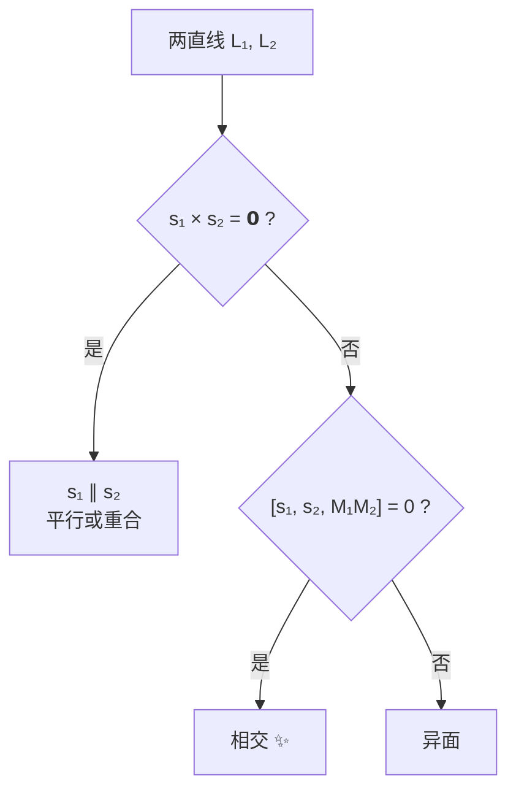

---
tags:
  - 高数
  - 空间解析几何
  - 直线
aliases:
  - 空间直线
---

# 1. 空间直线的方程

空间直线可以看作两个平面的交线，也可以由一个方向向量和一点唯一确定。这是与空间平面最本质的区别——平面由法向量"垂直地"确定，直线由方向向量"平行地"确定。

## 1.1 一般方程（交面式）

>[!definition] 定义（一般方程）
> 空间直线可表示为两个不平行的平面的交线：
>
> $$
> \begin{cases}
> A_1x + B_1y + C_1z + D_1 = 0 \\
> A_2x + B_2y + C_2z + D_2 = 0
> \end{cases}
> $$
>
> 其中 $\mathbf{n}_1 = (A_1,B_1,C_1)$ 与 $\mathbf{n}_2 = (A_2,B_2,C_2)$ 不平行。
>
注意到，直线的方向向量 $\mathbf{s}$ 同时垂直于两个平面的法向量，因此：

$$
\mathbf{s} = \mathbf{n}_1 \times \mathbf{n}_2
$$

这一关系是将一般方程转换为其他形式的关键。

## 1.2 对称式方程（点向式/标准式）

>[!definition] 定义（对称式方程）
> 设直线过点 $M_0(x_0, y_0, z_0)$，方向向量为 $\mathbf{s} = (m, n, p)$（其中 $m,n,p$ 不全为零），则直线上任意一点 $M(x,y,z)$ 满足 $\overrightarrow{M_0M} \parallel \mathbf{s}$，即：
>
> $$
> \frac{x - x_0}{m} = \frac{y - y_0}{n} = \frac{z - z_0}{p}
> $$

>[!warning]
> 当方向向量的某个分量为零时，对称式方程的形式需要特别注意。例如若 $m = 0$，则方程应理解为：
>
> $$
> x = x_0,\quad \frac{y - y_0}{n} = \frac{z - z_0}{p}
> $$
>
> 而不能写成 $\dfrac{x - x_0}{0}$。

## 1.3 参数方程
将对称式方程的比例系数设为参数 $t$：
>[!definition] 定义（参数方程）
>
> $$
> \begin{cases}
> x = x_0 + mt \\
> y = y_0 + nt \\
> z = z_0 + pt
> \end{cases}
> \qquad t \in \mathbb{R}
> $$

参数方程最适用于求直线与平面的交点：将参数形式代入平面方程，解出 $t$ 即得交点坐标。

## 1.4 两点式方程
过两点 $M_1(x_1,y_1,z_1)$、$M_2(x_2,y_2,z_2)$ 的直线，方向向量即为 $\overrightarrow{M_1M_2} = (x_2-x_1,\; y_2-y_1,\; z_2-z_1)$，代入对称式即得：

$$
\frac{x - x_1}{x_2 - x_1} = \frac{y - y_1}{y_2 - y_1} = \frac{z - z_1}{z_2 - z_1}
$$

# 2. 两直线的位置关系
## 2.1 两直线夹角
>[!corollary] 定理 1（两直线夹角的余弦）
> 设两直线 $L_1$、$L_2$ 的方向向量分别为 $\mathbf{s}_1 = (m_1, n_1, p_1)$、$\mathbf{s}_2 = (m_2, n_2, p_2)$，则夹角 $\theta$（锐角或直角）满足：
>
> $$
> \cos\theta = \frac{|\mathbf{s}_1 \cdot \mathbf{s}_2|}{|\mathbf{s}_1|\,|\mathbf{s}_2|}
> = \frac{|m_1m_2 + n_1n_2 + p_1p_2|}
>        {\sqrt{m_1^2 + n_1^2 + p_1^2}\,\sqrt{m_2^2 + n_2^2 + p_2^2}}
> $$

## 2.2 平行与垂直的判定
>[!corollary] 定理 2（两直线平行与垂直的条件）
> - **平行**（或重合）：$\displaystyle \frac{m_1}{m_2} = \frac{n_1}{n_2} = \frac{p_1}{p_2}$
> - **垂直**：$m_1m_2 + n_1n_2 + p_1p_2 = 0$，即 $\mathbf{s}_1 \cdot \mathbf{s}_2 = 0$
> ^line-relation

## 2.3 两直线是否相交

空间中两直线的位置关系有三种：**相交**、**平行**（含重合）、**异面**。判断的核心是「共面」：

>[!corollary] 定理（两直线共面的充要条件）
> 设 $L_1$ 过点 $M_1$、方向向量 $\mathbf{s}_1$；$L_2$ 过点 $M_2$、方向向量 $\mathbf{s}_2$。两直线**共面**当且仅当三向量 $\mathbf{s}_1,\mathbf{s}_2,\overrightarrow{M_1M_2}$ 共面，即混合积为零：
>
> $$
> [\mathbf{s}_1\,\mathbf{s}_2\,\overrightarrow{M_1M_2}]
> = (\mathbf{s}_1 \times \mathbf{s}_2) \cdot \overrightarrow{M_1M_2} = 0
> $$

**判别流程**：

1. 先算 $\mathbf{s}_1 \times \mathbf{s}_2$：
   - 若 $\mathbf{s}_1 \times \mathbf{s}_2 = \mathbf{0}$ → $\mathbf{s}_1 \parallel \mathbf{s}_2$，两直线**平行或重合**。
   - 若 $\mathbf{s}_1 \times \mathbf{s}_2 \neq \mathbf{0}$ → 方向不平行，继续第 2 步。

2. 算混合积 $(\mathbf{s}_1 \times \mathbf{s}_2) \cdot \overrightarrow{M_1M_2}$：
   - $= 0$ → 两直线共面且不平行 → **相交**。
   - $\neq 0$ → **异面**（对应 [[#5. 两异面直线间的距离|第 5 节]]）。

>[!tip] 如何求交点
> 若判断为相交，将两直线都写成参数方程，令对应坐标相等，解出参数即可得交点。

> [!example]+ 例：求两直线的交点
> 已知两直线：
>
> $$
> L_1: \frac{x-1}{1} = \frac{y-0}{2} = \frac{z-2}{-1},\qquad
> L_2: \frac{x-3}{2} = \frac{y-4}{0} = \frac{z-0}{1}
> $$
>
> **第 1 步：判断是否相交。**
>
> $\mathbf{s}_1 = (1,2,-1)$，$\mathbf{s}_2 = (2,0,1)$。$\mathbf{s}_1 \times \mathbf{s}_2 = (2,\,-3,\,-4) \neq \mathbf{0}$，不平行。
>
> $\overrightarrow{M_1M_2} = (3-1,\,4-0,\,0-2) = (2,4,-2)$。
>
> $$
> (\mathbf{s}_1 \times \mathbf{s}_2) \cdot \overrightarrow{M_1M_2}
> = 2 \times 2 + (-3) \times 4 + (-4) \times (-2) = 4 - 12 + 8 = 0
> $$
>
> 混合积为零且方向不平行 → 两直线**相交**。
>
> **第 2 步：求交点。**
>
> 写出参数方程（注意 $L_2$ 中 $y$ 恒为 4）：
>
> $$
> L_1: \begin{cases} x = 1 + t_1 \\ y = 2t_1 \\ z = 2 - t_1 \end{cases}\qquad
> L_2: \begin{cases} x = 3 + 2t_2 \\ y = 4 \\ z = t_2 \end{cases}
> $$
>
> 联立 $y$：$2t_1 = 4 \;\Rightarrow\; t_1 = 2$。
>
> 联立 $z$：$2 - t_1 = t_2 \;\Rightarrow\; 2 - 2 = t_2 \;\Rightarrow\; t_2 = 0$。
>
> 代入 $x$ 验证：$1 + t_1 = 3$，$3 + 2t_2 = 3$ ✓。
>
> **交点坐标**：$(3,\,4,\,0)$。

# 3. 直线与平面的位置关系

## 3.1 直线与平面的夹角

设直线方向向量为 $\mathbf{s} = (m, n, p)$，平面法向量为 $\mathbf{n} = (A, B, C)$。直线与平面的夹角 $\varphi$（锐角或直角）是直线与它在平面上投影直线的夹角：

$$
\sin\varphi = \frac{|\mathbf{s} \cdot \mathbf{n}|}{|\mathbf{s}|\,|\mathbf{n}|}
= \frac{|Am + Bn + Cp|}
{\sqrt{A^2 + B^2 + C^2}\,\sqrt{m^2 + n^2 + p^2}}
$$

注意这里是 **$\sin\varphi$**，不是 $\cos\varphi$！因为 $\varphi$ 是直线与平面法向量夹角的余角。

## 3.2 直线与平面平行或垂直
>[!corollary] 定理 3（直线与平面平行或垂直的条件）
> - **垂直**（直线是平面的"法线"）：$\displaystyle \frac{A}{m} = \frac{B}{n} = \frac{C}{p}$
>   — 即 $\mathbf{s} \parallel \mathbf{n}$，直线的方向向量平行于平面的法向量；
> - **平行**（或在平面内）：$Am + Bn + Cp = 0$
>   — 即 $\mathbf{s} \perp \mathbf{n}$；
>   - 若直线上有一点在平面内，则直线**完全在平面内**；
>   - 若直线上有一点不在平面内，则直线**与平面平行**。
> ^line-plane-relation

## 3.3 直线在平面上的投影

直线 $L$ 在平面 $\pi$ 上的投影 $L'$，就是 $L$ 上每一点向 $\pi$ 作垂线，所有垂足的集合。投影线 $L'$ 始终落在平面 $\pi$ 内。

> [!tip] 核心思路
> 投影线 = 给定平面 $\pi$ ∩ 过直线 $L$ 且垂直于 $\pi$ 的平面 $\Pi$。

**步骤**：

设直线 $L$ 过点 $M_0$、方向向量为 $\mathbf{s} = (m,n,p)$，平面 $\pi$ 的法向量为 $\mathbf{n} = (A,B,C)$。

1. **构造投影平面 $\Pi$**：过 $L$ 且垂直于 $\pi$ 的平面。其法向量同时垂直于 $\mathbf{s}$ 和 $\mathbf{n}$，即：

   $$
   \mathbf{n}_\Pi = \mathbf{s} \times \mathbf{n}
   $$

   由点法式写出 $\Pi$ 的方程（过 $M_0$，法向量 $\mathbf{n}_\Pi$）。

2. **联立得投影线**：$L'$ 就是 $\pi$ 与 $\Pi$ 的交线：

   $$
   L': \begin{cases}
   \pi: Ax + By + Cz + D = 0 \\\\
   \Pi: \text{(点法式方程)}
   \end{cases}
   $$

> [!tip] 另一种思路——直接求方向向量
> 投影线的方向向量 $\mathbf{s}'$ 就是 $\mathbf{s}$ 在平面 $\pi$ 上的投影向量：
>
> $$
> \mathbf{s}' = \mathbf{s} - \frac{\mathbf{s} \cdot \mathbf{n}}{|\mathbf{n}|^2}\,\mathbf{n}
> $$
>
> 再从 $L$ 上任取一点投影到 $\pi$ 上（若该点已在 $\pi$ 上则直接使用），结合 $\mathbf{s}'$ 即得对称式。

>[!warning] 特殊情况
>- 若 $L \perp \pi$（即 $\mathbf{s} \parallel \mathbf{n}$），则投影退化为一个**点**——直线与平面的交点。
>- 若 $L \subset \pi$（直线在平面内），则投影就是直线自身。

# 4. 点到直线的距离
>[!corollary] 定理 4（点到直线的距离公式）
> 点 $M_0(x_0, y_0, z_0)$ 到过点 $M_1$、方向向量为 $\mathbf{s}$ 的直线的距离为：
>
> $$
> d = \frac{|\overrightarrow{M_1M_0} \times \mathbf{s}|}{|\mathbf{s}|}
> $$

这个公式的几何意义十分直观：以 $\overrightarrow{M_1M_0}$ 和 $\mathbf{s}$ 为邻边的平行四边形面积除以底边长 $|\mathbf{s}|$，即为高——也就是点到直线的距离。这直接源于 [[01 向量及其运算|向量积的几何意义]]。

# 5. 两异面直线间的距离
>[!definition] 定义（异面直线）
> 空间中既不平行也不相交的两条直线称为**异面直线**。

>[!corollary] 定理 5（两异面直线间的距离）
> 设 $L_1$ 过点 $M_1$、方向向量为 $\mathbf{s}_1$；$L_2$ 过点 $M_2$、方向向量为 $\mathbf{s}_2$。则两异面直线的距离为：
>
> $$
> d = \frac{|[\mathbf{s}_1\,\mathbf{s}_2\,\overrightarrow{M_1M_2}]|}{|\mathbf{s}_1 \times \mathbf{s}_2|}
> = \frac{|(\mathbf{s}_1 \times \mathbf{s}_2) \cdot \overrightarrow{M_1M_2}|}
>        {|\mathbf{s}_1 \times \mathbf{s}_2|}
> $$

事实上，这个公式的分子是 $\mathbf{s}_1$、$\mathbf{s}_2$、$\overrightarrow{M_1M_2}$ 三向量构成的平行六面体的体积（即 [[01 向量及其运算|混合积]] 的绝对值），分母是以 $\mathbf{s}_1$、$\mathbf{s}_2$ 为邻边的平行四边形面积。两者相除即得平行六面体在公垂线方向上的"高度"，正是两异面直线的距离。

## 5.1 公垂线方程
两异面直线的公垂线方向向量为 $\mathbf{s} = \mathbf{s}_1 \times \mathbf{s}_2$（同时垂直于两直线）。公垂线方程可由以下条件联合求出：

1. 公垂线过 $L_1$ 上某点 $P_1$ 和 $L_2$ 上某点 $P_2$；
2. $\overrightarrow{P_1P_2} \parallel \mathbf{s}_1 \times \mathbf{s}_2$；
3. $P_1$ 在 $L_1$ 上，$P_2$ 在 $L_2$ 上（可用参数表示）。

# 6. 常见题型与解题流程
## 6.1 已知一点和方向向量，求直线方程
直接代入对称式或参数式即可。
## 6.2 已知一般方程，化为对称式
1. 求方向向量：$\mathbf{s} = \mathbf{n}_1 \times \mathbf{n}_2$；
2. 求直线上一点：令 $z = 0$（或其他适当值），解出 $x, y$；
3. 代入对称式。
## 6.3 求直线与平面的交点
将参数方程代入平面方程，解出参数 $t$，再代回得交点坐标。
## 6.4 求投影点
- 求点在平面上的投影：作过该点且垂直于平面的直线（方向 = 法向量），求直线与平面的交点。
- 求点在直线上的投影：作过该点且垂直于直线的平面（法向量 = 方向向量），求直线与平面的交点。
# 7. 易错点

>[!warning] 易错点
> 1. 直线与平面的夹角公式是 $\sin\varphi = \dfrac{|\mathbf{s}\cdot\mathbf{n}|}{|\mathbf{s}||\mathbf{n}|}$，切勿写成 $\cos$！
> 2. 方向向量有零分量时，对称式方程的写法需注意（对应分子也取零，不能写分母为零的分数）。
> 3. 两直线"平行"和"异面"是互斥的：平行直线共面，异面直线不共面——用 $\overrightarrow{M_1M_2} \cdot (\mathbf{s}_1 \times \mathbf{s}_2) \neq 0$ 判断异面。
> 4. 求直线方程时，方向向量可以乘以任意非零常数（方向不变），因此答案不唯一。
