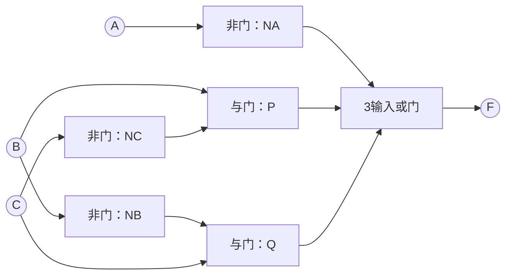
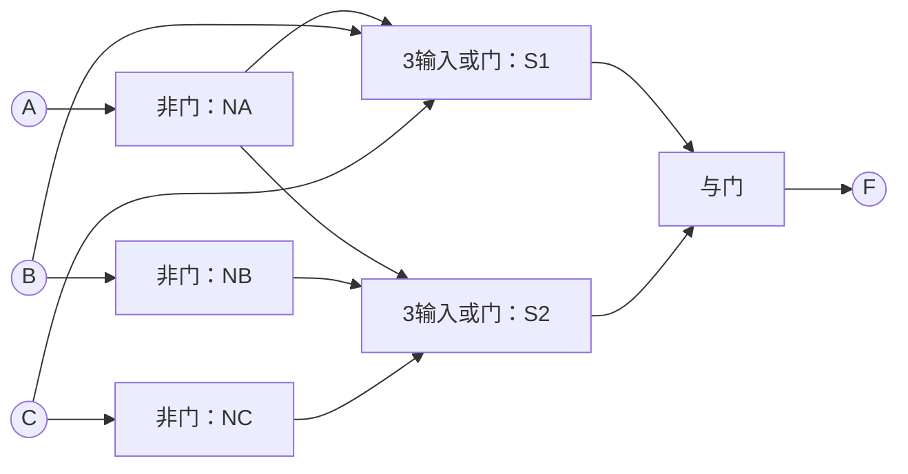

---
tags:
  - 数字逻辑
  - 逻辑门
  - 逻辑实现
aliases:
  - 与或式的门电路实现
  - 或与式的门电路实现
---

> [[ATLAS/卷9 数字逻辑与数字系统设计/目录|课程目录]] · [[ATLAS/卷9 数字逻辑与数字系统设计/第2章 布尔函数的逻辑实现/目录|第2章目录]]
> 来源：[[ATLAS/卷9 数字逻辑与数字系统设计/第2章 布尔函数的逻辑实现/附件/第2章布尔函数的逻辑实现.pdf#page=7|课件第 7–10 页]]。

# 1. 基本实现方法

把表达式中的每个反变量用**非门**产生，每个与运算用**与门**实现，每个或运算用**或门**实现，再连接相应输入、输出。

同一个反变量可以供多个门使用，通常无需为每次出现都单独设置一个非门。

# 2. 与或式的实现

>[!example] 课件例题
> $$F(A,B,C)=\bar A+B\bar C+\bar B C$$
> 先产生 $\bar A,\bar B,\bar C$；再计算两个积项；最后将三项相或。

设中间信号：

$$
N_A=\bar A,\quad N_B=\bar B,\quad N_C=\bar C
$$
$$
P=B N_C,\qquad Q=N_B C,\qquad F=N_A+P+Q
$$

| 元件 | 数量 | 作用 |
|---|:-:|---|
| 非门 | 3 | 产生三个反变量 |
| 2输入与门 | 2 | 分别产生 $B\bar C$、$\bar B C$ |
| 3输入或门 | 1 | 将三个项相或得到 $F$ |

# 3. 或与式的实现

同一函数也可写成：

$$
F=(\bar A+B+C)(\bar A+\bar B+\bar C)
$$

变换依据：

$$
(B+C)(\bar B+\bar C)=B\bar C+\bar B C
$$
$$
(X+Y)(X+Z)=X+YZ
$$

令 $X=\bar A$，即可验证它与原与或式等价。

中间信号与连线：

$$
S_1=\bar A+B+C,\qquad S_2=\bar A+\bar B+\bar C,\qquad F=S_1S_2
$$

| 元件 | 数量 | 作用 |
|---|:-:|---|
| 非门 | 3 | 产生 $\bar A,\bar B,\bar C$ |
| 3输入或门 | 2 | 分别产生 $S_1,S_2$ |
| 2输入与门 | 1 | 计算 $S_1S_2$ |

# 4. 实现时如何比较

与或式是“各项先与，最后或”；或与式是“各项先或，最后与”。两种形式实现的是同一逻辑功能，但门类型和输入端数不同。

>[!warning] 门数与芯片数不是同一概念
> 本例两种实现都用了6个逻辑门，但一片集成电路通常装有多个门。实际芯片数量还取决于型号、每片门数及门的输入端数，见 [[TTL集成逻辑门电路]]。

>[!tip] 复习检查
> 原式的 $\bar A$ 是**反变量**；$B\bar C$ 和 $\bar B C$ 的反相位置也不同。遗漏横线会改变逻辑功能。
