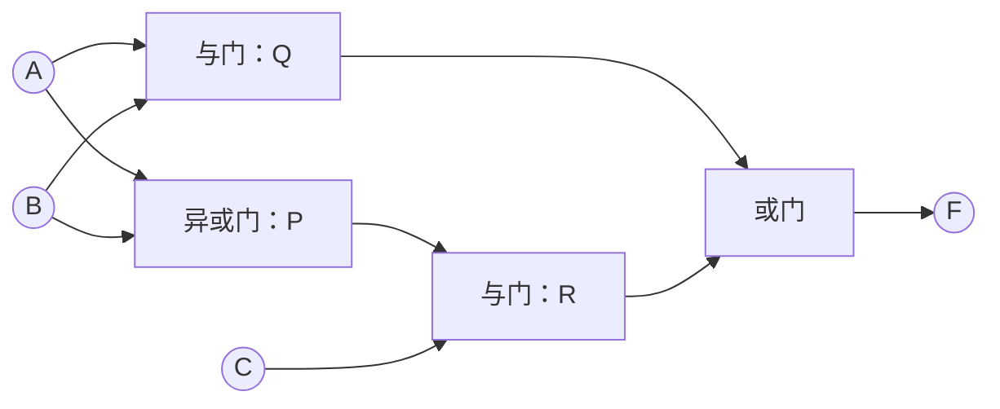
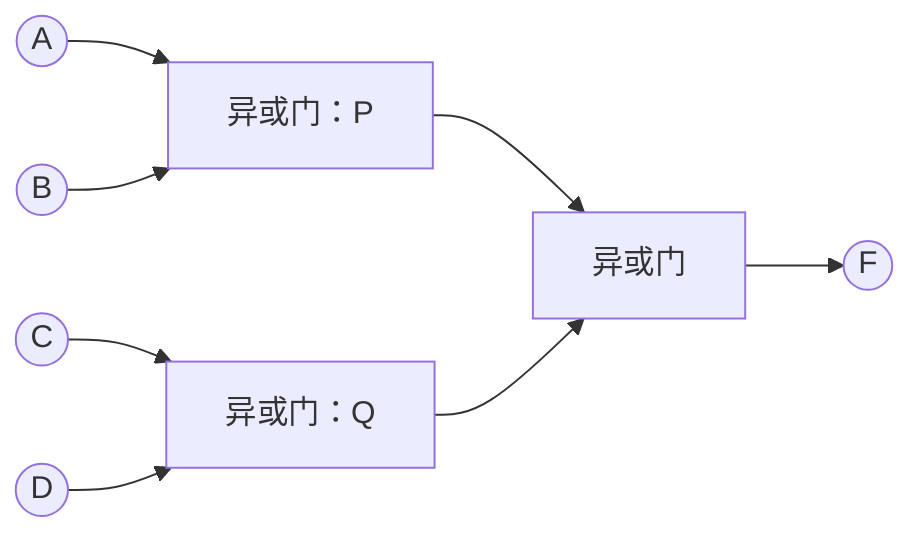

---
tags:
  - 数字逻辑
  - 逻辑门
  - 异或
aliases:
  - 异或门实现
  - 异或函数的卡诺图
---

> [[ATLAS/卷9 数字逻辑与数字系统设计/目录|课程目录]] · [[ATLAS/卷9 数字逻辑与数字系统设计/第2章 布尔函数的逻辑实现/目录|第2章目录]]
> 来源：[[ATLAS/卷9 数字逻辑与数字系统设计/第2章 布尔函数的逻辑实现/附件/第2章布尔函数的逻辑实现.pdf#page=26|课件第 26–29 页]]。

# 1. 保留异或关系

如果函数包含异或关系，直接用异或门实现该部分，其他逻辑关系仍由相应门实现，往往更清楚。

$$
A\oplus B=\bar A B+A\bar B
$$

异或不必强行展开成与或式。它与普通的或不同：$1\oplus1=0$，而 $1+1=1$。

# 2. 含异或关系的课件例题

$$
F(A,B,C)=AB+(A\oplus B)C
$$

定义中间信号：

$$
P=A\oplus B,\qquad Q=AB,\qquad R=PC,\qquad F=Q+R
$$

需要1个异或门、2个2输入与门、1个2输入或门。

>[!tip] 补充理解
> 该函数也等于 $AB+AC+BC$，当三个输入中至少两个为1时输出1。保留异或形式可直接反映课件给出的结构。

# 3. 多变量异或与奇偶性

$$
F=x_1\oplus x_2\oplus\cdots\oplus x_n
$$

当输入中有**奇数个1**时 $F=1$；有偶数个1时 $F=0$。

课件给出二、三、四变量异或卡诺图，共同特点是：

1. 0格、1格各占一半；
2. 逻辑相邻的两格取值相反，1格互不相邻；
3. 用普通与或式化简时，不能通过相邻1格合并减少项内变量，但可以识别成异或结构。

四变量异或的卡诺图（列为 $AB$，行为 $CD$，均按格雷码排列）：

| CD\AB | 00 | 01 | 11 | 10 |
|:---:|:---:|:---:|:---:|:---:|
| 00 | 0 | 1 | 0 | 1 |
| 01 | 1 | 0 | 1 | 0 |
| 11 | 0 | 1 | 0 | 1 |
| 10 | 1 | 0 | 1 | 0 |

因此：

$$
A\oplus B\oplus C\oplus D=\sum m(1,2,4,7,8,11,13,14)
$$

>[!warning] 不能只看“一半为1”
> 一半输出为1不是异或函数的充分条件，还要检查输入中1的奇偶性及相邻格的变化。将本图0、1互换，得到的是该异或函数的补函数。

# 4. 四变量异或的门电路

利用结合律：

$$
F=(A\oplus B)\oplus(C\oplus D)
$$

使用3个二输入异或门。该分组结构的最长路径经过2级门；逐个串接则最长经过3级门。级数对速度的影响见 [[集成逻辑门电路的工作特性与参数]]。

相关笔记：[[可靠性编码]]、[[逻辑运算的完备集与等价表示]]。
