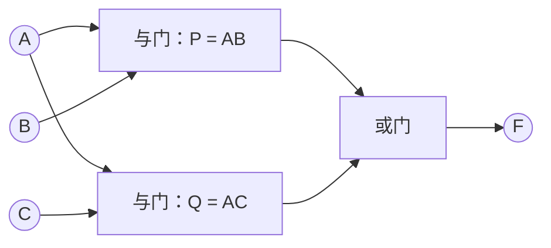
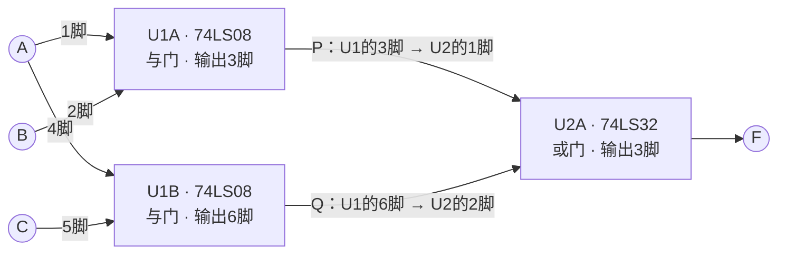
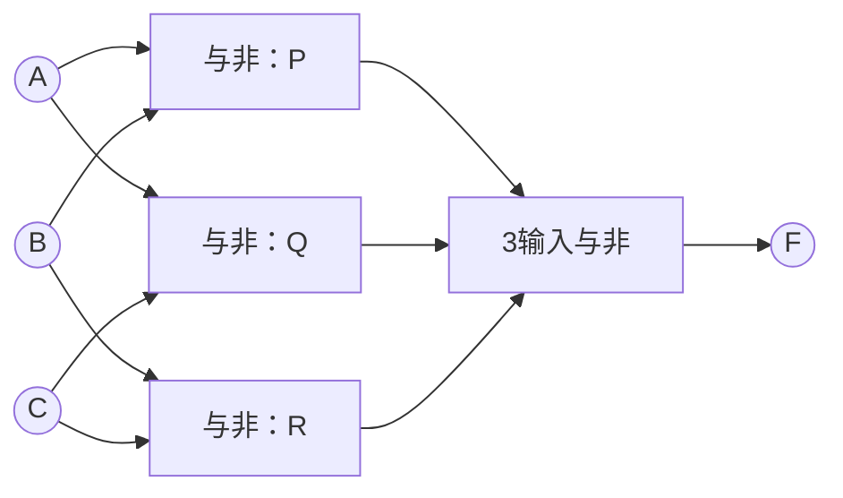
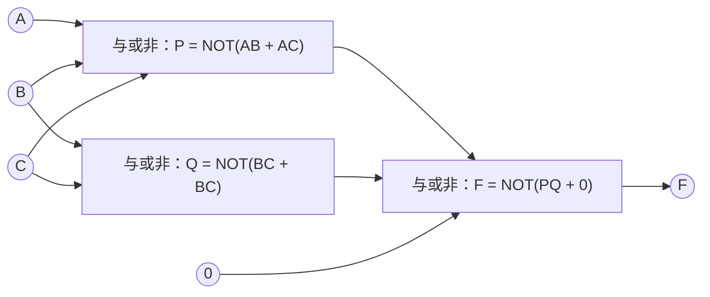
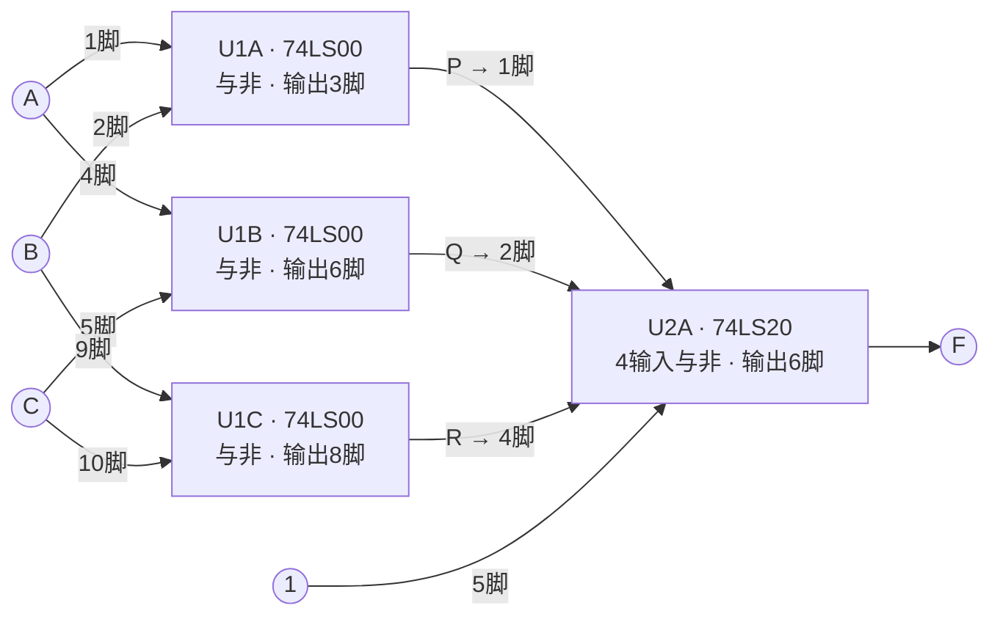
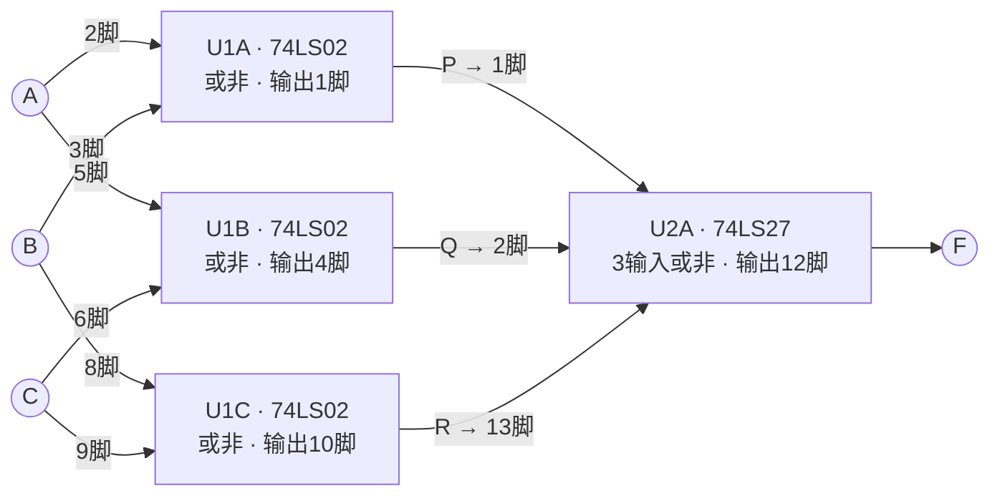
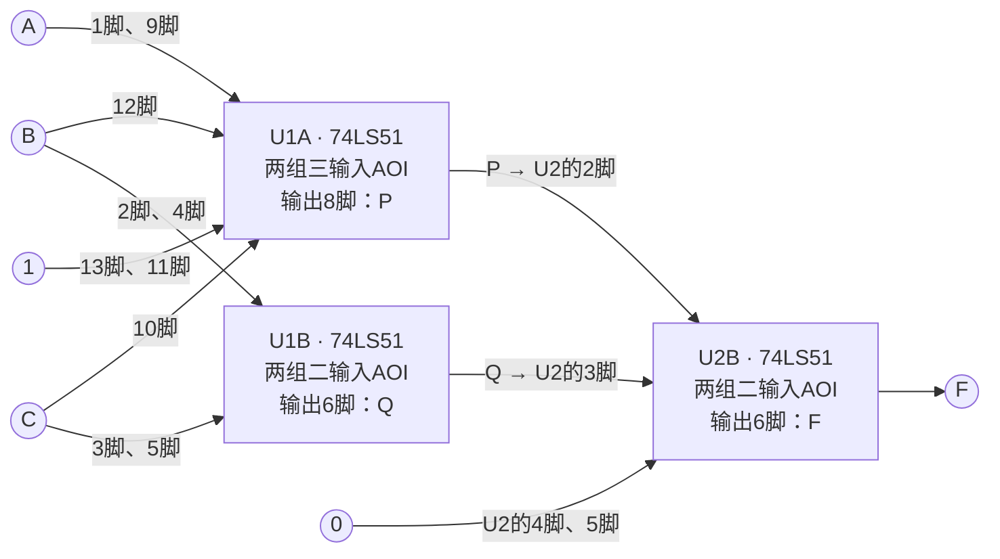

---
tags:
  - 数字逻辑
  - 逻辑实现
  - 习题
aliases:
  - 第4次作业
  - 门电路实现作业解析
---

> [[ATLAS/卷9 数字逻辑与数字系统设计/目录|课程目录]] · [[ATLAS/卷9 数字逻辑与数字系统设计/第2章 布尔函数的逻辑实现/目录|第2章目录]]
> 题目来源：[[ATLAS/卷9 数字逻辑与数字系统设计/第2章 布尔函数的逻辑实现/附件/第4次作业.pdf#page=1|第4次作业.pdf，第1页]]（以此6题版本为准）。

# 第4次作业 解析

> 作业覆盖：基本门和复合门实现、TTL器件与管脚标注、74/54系列比较、管脚排列识别。以下解法为补充解析；第2、4题均按新版要求列出器件名称和管脚标号。
>
> **统一约定**：器件接线采用 TI SN74LS 系列的 **N封装（PDIP-14）顶视图**；每片芯片14脚接 $+5\text{ V}$，7脚接GND。各题/方案中的U1、U2分别独立编号；U1A、U1B表示同一片U1内部的不同门单元。

# 1. 题1：用与、或、非门实现

**题目**：画出 $F(A,B,C)=AB+AC$ 的电路图。

令 $P=AB$、$Q=AC$，再令 $F=P+Q$。需要2个2输入与门和1个2输入或门。



>[!tip] 本题不需要非门
> 表达式中没有反变量，“用与、或、非门实现”不要求把三种门都用上。
> 若允许提取公因子，$F=A(B+C)$ 可改用1个或门和1个与门。

# 2. 题2：器件名称与管脚标号

**题目**：使用 TTL 与门74x08、或门74x32、非门74x04实现题1电路，标出各门电路的器件名称和管脚标号。

按题1的直接与或结构，选用 **U1：SN74LS08N** 和 **U2：SN74LS32N**。

| 门单元与型号 | 输入接线 | 输出接线 |
|---|---|---|
| U1A：74LS08第1个与门 | 1脚接 $A$；2脚接 $B$ | 3脚输出 $P=AB$，接U2的1脚 |
| U1B：74LS08第2个与门 | 4脚接 $A$；5脚接 $C$ | 6脚输出 $Q=AC$，接U2的2脚 |
| U2A：74LS32第1个或门 | 1脚接 $P$；2脚接 $Q$ | 3脚输出 $F=P+Q$ |



两片芯片均将14脚接 $+5\text{ V}$、7脚接GND。因此需要1片74LS08、1片74LS32；题目没有反变量，无需使用74LS04。

引脚依据：[TI SN74LS08 数据手册，第1页](https://www.ti.com/lit/ds/symlink/sn74ls08.pdf)、[TI SN74LS32 数据手册，第1页](https://www.ti.com/lit/ds/symlink/sn74ls32.pdf)。

>[!tip] 未使用门单元
> 本方案U1的9、10、12、13脚和U2的4、5、9、10、12、13脚是未使用门的输入，可统一接逻辑0；对应未使用的输出脚不连接。

# 3. 题3：分别用三类复合门实现

**题目**：分别画出用与非门、或非门和与或非门实现下式的电路图：

$$
F(A,B,C)=AB+AC+BC
$$

该函数在 $011,101,110,111$ 时为1，即三个输入中至少有两个为1。

## 3.1 与非门实现

$$
F=\overline{\overline{AB}\cdot\overline{AC}\cdot\overline{BC}}
$$



其中 $P=\overline{AB}$，$Q=\overline{AC}$，$R=\overline{BC}$。共4个与非门。

## 3.2 或非门实现

先转成或与式：

$$
AB+AC+BC=(A+B)(A+C)(B+C)
$$

再作二次取反：

$$
F=\overline{\overline{A+B}+\overline{A+C}+\overline{B+C}}
$$


其中 $P=\overline{A+B}$，$Q=\overline{A+C}$，$R=\overline{B+C}$。共4个或非门。

## 3.3 与或非门实现

由补函数：

$$
\bar F=\bar A\bar B+\bar A\bar C+\bar B\bar C
$$

得：

$$
F=\overline{\bar A\bar B+\bar A\bar C+\bar B\bar C}
$$

若反变量已提供，抽象上可用一个包含三个二输入积项组的与或非门；也可先得到 $\bar F=\overline{AB+AC+BC}$，再反相。

但**74LS51的单个门只有两个积项组**，不能把三个积项直接接进去。下面给出使用3个与或非门单元、无需输入反变量的方案：

$$
P=\overline{AB+AC},\qquad Q=\overline{BC+BC}=\overline{BC}
$$
$$
F=\overline{PQ+0\cdot0}=\overline{PQ}=AB+AC+BC
$$



图中的复合门按框内表达式分组接线，完整输入分配见题4。

# 4. 题4：三种实现的器件名称与管脚标号

**题目**：选择合适的 TTL 与非门、或非门、与或非门器件，实现题3电路，标出各门电路的器件名称和管脚标号。

下面每种方案独立实现 $F=AB+AC+BC$，引脚均按 **PDIP-14顶视图**。图中标出信号引脚；各片电源统一为14脚接 $+5\text{ V}$、7脚接GND。

## 4.1 与非方案：74LS00 + 74LS20

取 $P=\overline{AB}$、$Q=\overline{AC}$、$R=\overline{BC}$，末级实现 $F=\overline{PQR}$。

| 门单元与型号 | 输入接线 | 输出接线 |
|---|---|---|
| U1A：SN74LS00N | 1脚接 $A$；2脚接 $B$ | 3脚输出 $P$，接U2的1脚 |
| U1B：SN74LS00N | 4脚接 $A$；5脚接 $C$ | 6脚输出 $Q$，接U2的2脚 |
| U1C：SN74LS00N | 9脚接 $B$；10脚接 $C$ | 8脚输出 $R$，接U2的4脚 |
| U2A：SN74LS20N | 1脚接 $P$；2脚接 $Q$；4脚接 $R$；5脚接逻辑1 | 6脚输出 $F=\overline{PQR\cdot1}$ |



需要1片74LS00和1片74LS20。74LS20有4个输入，多出的5脚接逻辑1；其 **3、11脚是NC（内部无连接）**，不接线。

引脚依据：[TI SN7400/SN74LS00 数据手册，第3页](https://www.ti.com/lit/ds/symlink/sn7400.pdf)、[TI SN74LS20 数据手册，第1页](https://www.ti.com/lit/ds/symlink/sn74ls20.pdf)。

未使用输入：U1的12、13脚，U2的9、10、12、13脚，可统一接逻辑0；U1的11脚、U2的8脚是未使用输出，不连接。

## 4.2 或非方案：74LS02 + 74LS27

取 $P=\overline{A+B}$、$Q=\overline{A+C}$、$R=\overline{B+C}$，末级实现 $F=\overline{P+Q+R}$。

| 门单元与型号 | 输入接线 | 输出接线 |
|---|---|---|
| U1A：SN74LS02N | 2脚接 $A$；3脚接 $B$ | 1脚输出 $P$，接U2的1脚 |
| U1B：SN74LS02N | 5脚接 $A$；6脚接 $C$ | 4脚输出 $Q$，接U2的2脚 |
| U1C：SN74LS02N | 8脚接 $B$；9脚接 $C$ | 10脚输出 $R$，接U2的13脚 |
| U2A：SN74LS27N | 1脚接 $P$；2脚接 $Q$；13脚接 $R$ | 12脚输出 $F$ |



需要1片74LS02和1片74LS27。**74LS02第1门是“2、3脚输入，1脚输出”**，不能套用74LS00的“1、2脚输入，3脚输出”。

引脚依据：[TI SN74LS02 数据手册，第1页](https://www.ti.com/lit/ds/symlink/sn74ls02.pdf)、[TI SN74LS27 数据手册，第1页](https://www.ti.com/lit/ds/symlink/sn74ls27.pdf)。

未使用输入：U1的11、12脚，U2的3、4、5、9、10、11脚，可统一接逻辑0；对应未使用输出U1的13脚、U2的6、8脚不连接。

## 4.3 与或非方案：2片74LS51

取 **U1、U2均为SN74LS51N**。每片内部的1号门是两组三输入与或非门，2号门是两组二输入与或非门。按数据手册，有：

$$
1Y=\overline{(1A\cdot1B\cdot1C)+(1D\cdot1E\cdot1F)},\qquad
2Y=\overline{(2A\cdot2B)+(2C\cdot2D)}
$$

为与题3标号保持一致，以下记1号门为A单元、2号门为B单元。

| 门单元 | 第1积项组接线 | 第2积项组接线 | 输出 |
|---|---|---|---|
| U1A：两组三输入 | 1脚接 $A$；12脚接 $B$；13脚接1 | 9脚接 $A$；10脚接 $C$；11脚接1 | 8脚输出 $P=\overline{AB\cdot1+AC\cdot1}$ |
| U1B：两组二输入 | 2脚接 $B$；3脚接 $C$ | 4脚接 $B$；5脚接 $C$ | 6脚输出 $Q=\overline{BC+BC}$ |
| U2B：两组二输入 | 2脚接 $P$（U1的8脚）；3脚接 $Q$（U1的6脚） | 4、5脚均接0 | 6脚输出 $F=\overline{PQ+0\cdot0}$ |



由德·摩根定理：

$$
F=\overline{\overline{AB+AC}\cdot\overline{BC}}=AB+AC+BC
$$

两片共使用3个与或非门单元。U2未用的1号门输入1、9、10、11、12、13脚可全部接0，其输出8脚不连接。两片的14脚接 $+5\text{ V}$，7脚接GND。

引脚与分组依据：[TI SN74LS51 数据手册，第1页LS51顶视图及第2页逻辑图](https://www.ti.com/lit/ds/symlink/sn74ls51.pdf)。**应查LS51的引脚图，不能混用7451或74S51的图。**

# 5. 题5：74系列和54系列的异同

**题目**：TTL集成逻辑门电路中分为74系列和54系列，这两大系列有什么异同？

**相同点**：对应同一功能编号、同一技术子系列的器件，基本逻辑功能相同；例如SN74LS00与SN54LS00都含4个2输入与非门。选择对应封装时，应查看引脚兼容关系；标称供电通常都是5 V。

**不同点**：74通常为民用/商用系列，54为军用温度范围系列，后者适用的环境温度与电源容差范围更宽。以TI的SN7400/SN5400及对应LS00系列数据为例：

| 项目 | 74系列示例 | 54系列示例 |
|---|---|---|
| 常见用途分类 | 民用/商用 | 军用温度范围 |
| 工作环境温度 | $0\sim70\,^{\circ}\mathrm C$ | $-55\sim125\,^{\circ}\mathrm C$ |
| 推荐供电范围示例 | $4.75\sim5.25\text{ V}$ | $4.5\sim5.5\text{ V}$ |
| 标称电源 | 5 V | 5 V |
| 对应功能 | 相同功能编号实现对应逻辑运算 | 相同功能编号实现对应逻辑运算 |

以上温度和供电数值来自 [TI SN7400/SN5400数据手册，第6.3节](https://www.ti.com/lit/ds/symlink/sn7400.pdf)，用于本题举例；具体器件仍按其数据手册取值。

>[!important] 简答要点
> **对应器件的逻辑功能基本相同，主要区别在允许的工作温度范围、电源电压范围等使用条件。** 不应写成“所有电气参数完全相同”，也不要把74/54与LS、S、ALS等技术子系列混为一谈。

# 6. 题6：如何查看TTL集成门电路的管脚排列

**题目**：如何查看TTL集成门电路的管脚排列？

以课件使用的双列直插DIP封装为例：

1. **确认型号和封装**：读清芯片上的完整型号，再找该封装的引脚图。
2. **从顶面观察**：看印有型号的正面，找到缺口或1脚定位标记；确认数据手册写的是顶视图（TOP VIEW）。
3. **确定1脚**：缺口朝上时，左上角是1脚；若缺口朝左，则左下角是1脚。
4. **逆时针编号**：从1脚沿左列向下，再从右列向上依次编号。DIP-14的左列从上到下为1–7，右列从下到上为8–14。
5. **查每脚功能**：对照数据手册区分输入、输出、电源、地和NC。外壳一样、脚数一样，内部逻辑与信号引脚也可能不同。

```text
          DIP-14顶视图，缺口朝上
                 ┌──∪──┐
           1  ───┤     ├─── 14
           2  ───┤     ├─── 13
           3  ───┤     ├─── 12
           4  ───┤     ├─── 11
           5  ───┤     ├─── 10
           6  ───┤     ├───  9
           7  ───┤     ├───  8
                 └─────┘
```

本作业所选PDIP-14芯片的14脚均为 $V_{CC}$、7脚均为GND，但不能将这一位置直接推广到所有TTL芯片和所有封装。

>[!warning] 两个常见混淆
> - 从芯片底面看，左右会镜像，不能照搬顶视图的左右位置。
> - **NC脚**表示内部未连接，保持不接；**未使用的逻辑输入脚**仍是输入，应接确定电平。两者不是一回事。

相关基础：[[TTL集成逻辑门电路]]。

# 7. 易错点

- 题1的 $AB+AC$ 没有反变量，不必额外增加非门。
- “3输入与非”不能直接换成串联的两个2输入与非门，因为中间反相会改变表达式。
- 多余输入应接不改变逻辑的值，例如与非门多余输入接1、或非门多余输入接0；不要把悬空当作规范逻辑连接。
- 门单元数量、每门输入数、每片门数分别统计。
- 与或非门需要核对积项**分组数**，不能只看总输入数。

以上函数关系和所列门级接线已按全部输入组合核对，管脚编号已对照对应型号的TI数据手册。
