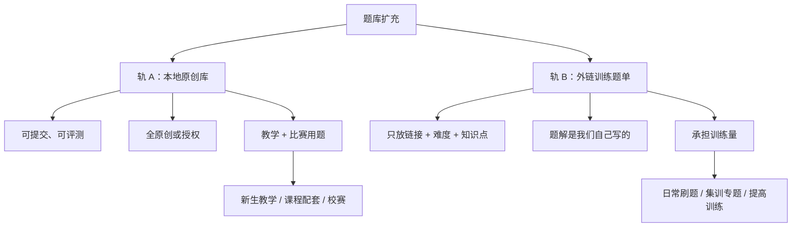
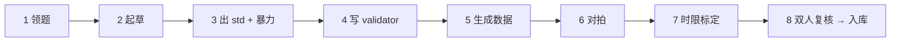
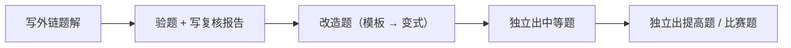

---
tags:
  - OJ
  - 竞赛
  - 计划
aliases:
  - 华电OJ题库扩充计划
---

# 华电 OJ 题库扩充计划

> **目标**：一学年内把本地原创题库从 <100 题铺到 550（承诺）–800（冲刺）题，并配套 1000+ 道外链训练题单，覆盖新生入门、课程配套、校队集训、校级比赛四类需求。
> **硬约束**：本地库只放原创或明确授权题（版权红线）；团队 5–10 人，能独立出完整题的 2–3 人；小额激励预算。
> **状态**：骨架已定。日期锚点、预算数字、3 项 Hydro 能力待实测 —— 见 [§13](#13-待补输入与下一步)。

---

## 0. 一页速览

| 阶段 | 相对周期 | 本地库累计（承诺/冲刺） | 外链题单 | 核心交付 |
|---|---|---|---|---|
| 第 0 步 盘点 | 2 周 | — | — | 《现有题目体检表》+ 知识点缺口表 |
| 阶段一 冷启动 | 8 周 | 80 / 100 | 入门 100 | 标签体系、题目仓库、命题手册、流水线跑通 |
| 阶段二 教学铺量 | 14 周 | 280 / 380 | 普及提高 200 | 模板题家族 6 大专题、课程配套题单 |
| 阶段三 比赛期 | 10 周 | 430 / 560 | 专题 200 | 新生赛 + 校赛（题面+数据+题解+讲评） |
| 阶段四 集训收口 | 12 周 | 550 / 800 | 集训专题 300 | 提高题、选拔赛、学年复盘 |

**一句话结构**：本地库（可提交、可评测、全原创）负责「教什么」；外链题单（只放链接 + 我们自己的题解）负责「练多少」。两条腿分开定指标，不混着算。

---

## 1. 现状与约束

### 1.1 盘点结论

>[!important] 我们手里的牌
> - **平台**：自建 Hydro，管理员权限（能批量建题、开比赛、管标签、装插件、写脚本）
> - **已有能力**：自改 VJudge 插件 v1.10.0（`VJUDGE.md`，2026-07-22），支持用户绑定个人 CF 账号 + `ProblemAdd → Import From Remote OJ`
> - **库容**：< 100 题，基本是空库，从零铺
> - **人力**：5–10 人，其中 2–3 人能独立出完整题
> - **经验**：已完成一场新生赛（A–H 八题 + tutorial.pdf + 题解.pptx），全流程走通过一次

### 1.2 三条硬约束

1. **版权**：本地库只能放原创或有明确授权的题 → `Import From Remote OJ` 那条路（`ProblemModel.add()` 会把远程题面复制进本地库）**不能用于入库**，它会直接踩红线。
2. **人力**：社团规模，不是工作室，产能天花板低（见 [§4](#4-产能模型800-题的账)）。
3. **受众四类**：新生零基础 / 课程配套（数据结构、算法）/ 校队选拔集训 / 校级比赛。四类对题目的要求不一样，不能一锅端。

---

## 2. 核心设计：双轨制

这是整个方案的承重墙。**把"教什么"和"练多少"拆成两条轨，各自定指标。**

### 轨 A：本地原创库

- 内容：教学模板题家族、入门语法题、中等题、提高题、比赛用题
- 特点：可提交、可评测、有数据、有题解、全原创
- 指标：**550 承诺 / 800 冲刺**（一学年）

### 轨 B：外链训练题单

- 内容：CF / AtCoder / 洛谷 / QOJ / 牛客 的题目，**只放链接，不复制题面**
- 我们的原创部分：**题解**、难度标定、知识点标签、推荐顺序
- 为什么合法：不复制题面就不涉及复制权，本质是"引用链接 + 自撰评注"
- 为什么必要：教学和集训真正缺的"量"，靠本地原创填不满（见 [§4](#4-产能模型800-题的账)）
- 指标：**1000+ 题索引**（入门 100 / 普及提高 200 / 专题集训 300 / 校赛真题 200+）

>[!tip] 顺手的好处
> 轨 B 的题解是我们自己写的 → 属原创内容，可以署名、可以进投稿排行榜。写外链题解是**新手命题人的练兵场**：不用造数据、不用验题，但要把思路讲清楚。带新人通常从这里开始，比直接让他出题成功率高得多。

---

## 3. 版权红线：入库判定规则

**受版权保护的是"具体表达"（题面文字 + 测试数据），不是算法思想。** 这一条决定了我们能不能规模上量。

### 3.1 三问判定法

任何一道题入库前，出题人自己先过这三问：

1. 题面最后一个字，是我写的吗？
2. 数据是我自己跑出来的吗？
3. 我能不能说清每一句话的出处？

**三问全"是" → 原创题，可入库。任何一问心虚 → 转轨 B，只放链接。**

### 3.2 允许 / 禁止清单

| 做法 | 判定 | 说明 |
|---|---|---|
| 借算法思想（"这道题考带修莫队"）出全新题 | ✅ 允许 | 算法思想不受版权保护 |
| 借"题目类型"（"来一道扫描线"）出全新题 | ✅ 允许 | 类型/套路属于公共知识 |
| 题面和数据完全自写、自造 | ✅ 允许 | 这就是原创题 |
| 题解里注明"思想参考自 CF1234A" | ✅ 鼓励 | 学术诚信，不构成侵权 |
| 翻译外站题面后入库 | ❌ 禁止 | 翻译权属于原作者 |
| 把外站题"换个背景/改个数字"入库 | ❌ 禁止 | 演绎作品，仍需授权 |
| 复制题面（含 OCR 扫描件）| ❌ 禁止 | 直接复制 |
| 直接用他人的测试数据 | ❌ 禁止 | 数据也是受保护表达 |
| 用 CC-BY / 明确书面授权题库 | ✅ 允许 | **必须保存授权凭证**（截图/邮件进 `授权凭证/`） |

>[!warning] 最容易踩的坑
> "改编"这个词有两种含义，差别是天壤之别：
> - **借思想重写**（题面数据全自写）= 原创，可以放心上量 ✅
> - **改背景的演绎**（保留原题结构与表达）= 侵权风险 ❌
>
> 团队统一口径时，别说"改编"，直接说"**借思想自写**"或者"**演绎改造**"，避免新人误解。

---

## 4. 产能模型：800 题的账

### 4.1 单题成本

| 题型 | 典型例子 | 单题工时（含题面+std+暴力+数据+题解+验题） |
|---|---|---|
| 教学模板题·模板 | 线段树区间加区间求和 | 2.0 h |
| 教学模板题·变式 | 同上换背景/换约束/换问法 | 0.4 h |
| 入门语法题 | 循环、数组、字符串、模拟 | 1.0 h |
| 中等题 | 省赛铜银档 | 3.5 h |
| 提高题 | 省赛金 / 区域赛档 | 8.0 h |
| 比赛题（新题部分） | 新生赛、校赛用 | 6.0 h |
| 比赛验题 + 题解 | 每题 | 1.0 h |

### 4.2 800 题需要多少工时

按"模板题占大头"的配比（你选的路线）：

| 类别 | 题量 | 单题工时 | 小计 |
|---|---|---|---|
| 教学模板题·模板 | 67 | 2.0 h | 134 h |
| 教学模板题·变式 | 333 | 0.4 h | 133 h |
| 入门语法题 | 200 | 1.0 h | 200 h |
| 中等题 | 130 | 3.5 h | 455 h |
| 提高题 | 40 | 8.0 h | 320 h |
| 比赛新题 | 30 | 6.0 h | 180 h |
| 比赛验题+题解 | 40 | 1.0 h | 40 h |
| **小计** | **800 题** | | **1462 h** |
| 审题返工 + 数据返修（+15%） | | | ~1680 h |

### 4.3 团队产能

| 角色 | 人数 | 每周有效工时 | 周数 | 有效系数 | 小计 |
|---|---|---|---|---|---|
| 主力（含你） | 3 | 5 h | 36 | 1.0 | 540 h |
| 新手投稿 | 5 | 3 h | 36 | 0.5（培训+返工） | 270 h |
| **合计** | **8** | | | | **810 h** |

>[!warning] 账算不平
> **1680 h 需求 vs 810 h 产能 → 缺口 2.1 倍。**
> 直说的话：按现在的团队规模，一年硬出 800 道**质量过关**的本地题是做不到的。做得到的量在 320–350 题。
> 这不是劝你降目标，是先把缺口摆出来，再看用什么把它补上。

### 4.4 四条补缺口的杠杆

| 杠杆 | 省下 / 增加 | 前提 |
|---|---|---|
| **AI 辅助起草** | 教学型+入门题工时 ×0.3 → 省约 300 h | 成品必须人工校验、自造数据、由人署名；AI 只当草稿工具 |
| **模板题家族化** | 已在配比内，变式边际成本 0.4 h | 需要先出好模板题和变式设计规范 |
| **投稿激励生效** | 新手有效系数 0.5 → 0.75 → +135 h | 奖励机制 + 审题清单 + 老带新（见 [§10](#10-投稿激励与人才培养)） |
| **团队扩到 12 人活跃** | +4 新手 ≈ +210 h | 需要招新 + 培训体系，见效周期约一个学期 |

叠加后：810 + 300 + 135 + 210 ≈ **1455 h → 覆盖 87% → 约 690 题**。

### 4.5 三档情景（这是要你拍板的）

| 情景 | 前提 | 本地库 | 外链索引 | 态度 |
|---|---|---|---|---|
| **保守** | 只靠现有人力，不用 AI 起草 | ~330 题 | 1000 题 | 稳，但不叫"大规模" |
| **基准** ⭐ | AI 起草 + 激励生效 + 扩到 12 人 | ~550–690 题 | 1000 题 | 推荐作为**承诺目标** |
| **冲刺** | 基准 + 提高题压到 40 以内 + 全员冲刺 | ~800 题 | 1200 题 | 作为**学年末冲刺目标** |

**我的建议**：把 **550 定为承诺目标**（写进跟社团/指导老师的汇报里），**800 定为冲刺目标**（期末复盘时的加分项）。把 800 当承诺写，一旦人力波动就是失信；当冲刺写，达成了是超额。

---

## 5. 难度分层与标签体系

### 5.1 难度七档（对标洛谷色，团队必须统一口径）

| 档位 | 颜色 | 目标 AC 率 | 典型内容 |
|---|---|---|---|
| 入门 | 红 | 70–90% | 输入输出、分支、循环 |
| 普及- | 橙 | 55–75% | 数组、字符串、简单模拟 |
| 普及 | 黄 | 40–60% | 排序、贪心、二分、前缀和、递归 |
| 普及+ | 绿 | 30–45% | DFS/BFS、并查集、简单 DP、栈队列 |
| 提高 | 蓝 | 20–35% | 最短路、线段树、树状数组、背包、拓扑 |
| 提高+ | 紫 | 10–20% | 树剖、AC 自动机、状压 DP、网络流 |
| 省选 | 黑 | < 10% | 高级数据结构、计算几何、多项式 |

>[!important] AC 率是校准工具，不是装饰
> 每题上线 2 周后看真实 AC 率。**偏离目标区间超过 15 个百分点 → 难度标签改档**。
> 新手出题最常犯的错就是自认为"普及"实际是"提高"（或者反过来），靠这个数字自动纠偏。

### 5.2 标签体系（Hydro 侧）

每道题必须打满五类标签：

| 类别 | 取值示例 | 说明 |
|---|---|---|
| 难度 | 普及+ | 七档之一 |
| 知识点 | 数据结构 / 树状数组 / 区间查询 | **三级**：大类 / 子类 / 具体 |
| 用途 | 课程配套、校赛、集训 | 可多选 |
| 来源 | 原创-夏宇 / 投稿-2024xxxx / 授权-来源名 | 版权追溯的唯一凭据 |
| 状态 | 草稿 / 待验 / 已入库 / 需修订 | 流水线状态 |

### 5.3 知识点矩阵（驱动上量的引擎）

按大类列必备知识点 → 对照现有题 → 得出缺口 → **缺口变成"领题任务单"**。这是整个扩充计划真正的发动机：不靠"大家加油多出题"，靠"这张表上有 23 道题没人认领"。

| 大类 | 子类（每个子类目标：1 模板 + 4 变式 + 1 中等） |
|---|---|
| 基础语法 | 输入输出、分支、循环、数组、字符串、函数、结构体 |
| 基础算法 | 排序、贪心、二分、前缀和/差分、双指针、模拟、枚举 |
| 数据结构 | 栈队列、链表、并查集、堆、树状数组、线段树、ST 表、字典树 |
| 搜索 | DFS、BFS、回溯、剪枝、双向 BFS |
| 动态规划 | 线性、背包、区间、树形、状压、数位、优化 |
| 图论 | 最短路、最小生成树、拓扑排序、二分图、强连通、树上问题 |
| 数学 | 数论、组合计数、概率期望、博弈、矩阵快速幂 |
| 字符串 | KMP、哈希、Manacher、AC 自动机、后缀数组 |

**启动动作**：把这张表变成在线表格（谁认领、什么状态、预计交付日），双周会的唯一议程。

---

## 6. 每题的交付标准（DoD）

一道题"做完"的定义，七件套缺一不可：

- [ ] **题面**（md 草稿 + 正式版）：含数据范围、样例、样例解释、必要的提示
- [ ] **std**：正确解，带注释，能过全部数据
- [ ] **至少 1 份错解**：用于对拍，也是卡数据的依据
- [ ] **数据**：分组，含样例 / 边界 / 最大规模 / 随机 / 构造陷阱
- [ ] **题解**：思路 + 复杂度分析 + 坑点，用于赛后讲评
- [ ] **时限/空限设定理由**：std 实测用时 × 3–5 倍，写明标定环境
- [ ] **五类标签**：难度 / 知识点 / 用途 / 来源 / 状态

>[!tip] 双人复核是质量的唯一保障
> **出题人 ≠ 验题人**，且验题人必须真的把 std 重写一遍或至少逐行读懂。
> 单条最有效的规则，没有之一：自己验自己的题，几乎必然漏掉数据漏洞和被错误解法过的漏洞。

---

## 7. 命题流水线（8 步）

题目源文件用 git 管理，仓库布局沿用 `polygon-spec` 的规范（`config/` `solutions/` `generators/` `validators/` `tests/` `draft/` `statement-sections/`），好处是：源文件可复用、可回滚、多人协作不打架、将来能导出成标准题包。

| 步 | 动作 | 产物 | 常见坑 |
|---|---|---|---|
| 1 领题 | 从知识点缺口表认领，登记到在线表 | 认领记录 | 两人撞题；先查重再领 |
| 2 起草 | 题面 md + 解法草稿（`draft/`） | `statement.md` `solution.md` | 题面漏数据范围；样例与题意不符 |
| 3 出 std + 暴力 | 正确解 + 朴素解 | `solutions/*.cpp` + `.desc` | 只有 std 没暴力 → 后面无法对拍 |
| 4 写 validator | 约束校验器 | `validators/*.cpp` | 不写 validator → 生成器出脏数据，std 崩了都不知道为什么 |
| 5 生成数据 | 样例 → 边界 → 最大规模 → 随机 → 构造陷阱 | `tests/` | 只有随机数据 → 错解能过；忘测 $n = 1$、全相同、退化链 |
| 6 对拍 | std vs 暴力 stress test | 对拍日志 | 只跑 100 组就收工，至少要 10⁴ 组 |
| 7 时限标定 | std 用时 × 3–5 倍 | 时限设定理由 | 按本机速度定 → 评测机上 TLE 或放水 |
| 8 复核入库 | 双人复核 → 导入 Hydro → 打标签 → 出题解 → 署名 | 线上题目 | 漏打标签 → 半年后没人知道这题考什么 |

>[!warning] 数据强度是选题的"可信度"
> 教学题可以弱数据，比赛题不行。新生赛/校赛的题如果被一个错解 AC 了，选手会当场发现——这种事发生一次，OJ 的公信力就掉一档。**比赛题的数据强度必须有人专门验，这是阶段三的最高优先级。**

---

## 8. 外链题单（轨 B）设计

### 8.1 形式

用 Hydro 的「训练」模块建题单，题目条目用**外部题目**类型（标题 + 链接 + 难度），我们自己补上题解和推荐顺序。

> [!warning] 待实测
> Hydro「训练」模块是否支持"外部题目"条目（只需标题+URL，不导入题面），需要连到我们自己的实例验证。若当前版本不支持，退路是：用一篇 markdown 长文做题单页（表格：题名 / 链接 / 难度 / 知识点 / 题解链接），挂到 OJ 的公告/博客模块。两种都能达成"只放链接"的目的。

### 8.2 四个清单

| 清单 | 题量 | 面向 | 内容 |
|---|---|---|---|
| 入门 100 | 100 | 大一新生 | 语法 → 模拟 → 基础算法，按周分块 |
| 普及提高 200 | 200 | 普通学生 / 课程配套 | 按知识点分类，每题配自己写的题解 |
| 专题集训 300 | 300 | 校队 | DP / 图论 / 数据结构 / 数学 / 字符串 五大专题 |
| 校赛真题 200+ | 200+ | 备赛 | 近年省赛/区域赛真题，按难度和知识点索引 |

### 8.3 题解是我们的原创资产

外链题解的价值被低估了：它让"不能复制题面"从一个限制变成优势——**别人只能做题，我们能做题 + 讲题**。训练营、赛后讲评、社团招新 demo，全靠这批题解。

---

## 9. 四阶段路线图

>[!warning] 待补：日期锚点
> 下面用相对周数写。你把**开学 / 新生赛 / 校赛 / 省赛选拔 / 期末**的真实月份报给我，我改成绝对日期对准校历。

### 第 0 步：盘点（2 周，与阶段一并行）

- 逐题过一遍现有 <100 题 → 产出《现有题目体检表》：保留 / 重做 / 下线
- 按 [§5.3](#53-知识点矩阵驱动上量的引擎) 建知识点矩阵，标出现有覆盖和缺口
- 产出：**缺口表 = 领题任务单**

### 阶段一：冷启动（8 周）

| 项 | 内容 |
|---|---|
| 目标 | 本地累计 **80 / 100** 题；外链入门题单 100 题上线 |
| 交付 | ① 难度与标签标准文档 ② 题目仓库模板（git）③ 命题手册（含 8 步流水线 + 检查清单）④ 投稿模板 + 审题清单 ⑤ 新生入门题单 ⑥ 3 名主力各出 3 题并互相验题的演练记录 |
| 验收 | 连续 4 周每周入库 ≥ 10 题；任一题从投稿到入库 ≤ 7 天 |
| 风险 | 流水线没跑通就急着上量 → 后期全是返工。**这一阶段宁慢勿快。** |

### 阶段二：教学铺量（14 周）

| 项 | 内容 |
|---|---|
| 目标 | 本地累计 **280 / 380** 题 |
| 交付 | ① 模板题家族 6 大专题（线段树 / 树状数组 / 并查集 / 最短路 / DP / 字符串）② 课程配套题单 3 套（按课程章节）③ 投稿排行榜 + 奖励机制上线 |
| 验收 | 课程配套题单被 ≥ 50% 选课学生使用；投稿采纳 ≥ 40 题 |
| 关键 | 对齐数据结构/算法课的**实际教学进度**，别自己编顺序 |

### 阶段三：比赛期（10 周）

| 项 | 内容 |
|---|---|
| 目标 | 本地累计 **430 / 560** 题；外链专题题单上线 |
| 交付 | ① 新生赛 1 场（8–12 题）② 校赛 1 场（10–13 题）③ 两场完整题解 + 赛后讲评 ④ 外链校赛真题索引 |
| 验收 | 比赛零事故（无重测、题面勘误 ≤ 1 次）；赛后 48 h 内出题解 |
| 关键 | 数据强度由专人复核；比赛前 2 周冻结题目，只修不增 |

### 阶段四：集训收口（12 周）

| 项 | 内容 |
|---|---|
| 目标 | 本地累计 **550 / 800** 题；外链集训专题 300 题 |
| 交付 | ① 专题集训题单 4 套（DP / 图论 / 数据结构 / 数学）② 提高题补齐 ③ 省赛选拔赛 1 场 ④ 学年复盘报告 + 下一年计划 |
| 验收 | 题库难度分布符合目标曲线；**≥ 5 名新手能独立出中等题**（人才指标，比题量重要） |

---

## 10. 投稿激励与人才培养

### 10.1 为什么投稿是生死问题

你的团队只有 3 个主力。想从 330 题走到 550+，唯一的杠杆是**把新手变成产能**。这件事的成败决定整个计划的成败，不是"锦上添花"的部分。

### 10.2 激励设计

**积分制**（建议）：

| 行为 | 积分 |
|---|---|
| 出一道采用入库的入门/模板题 | 1 |
| 出一道采用入库的中等题 | 3 |
| 出一道采用入库的提高题 | 6 |
| 验题一次（写复核报告） | 1 |
| 写一篇外链题解 | 0.5 |
| 题目发现数据漏洞并修复 | 2 |

**兑换**：周边 / 红包 / 题解署名 / 团队头衔（如"特约命题人"）。
**预算建议**：300–500 元/学期（具体数字待你定，见 [§13](#13-待补输入与下一步)）。

**排行榜**：出题数 / 验题数 / 采纳率 / 返工率 四个数字公开，每双周更新。采纳率和返工率比出题数更重要——防止有人交凑数题刷积分。

### 10.3 新人培养路径（约 6 个月）

| 阶段 | 周期 | 门槛 |
|---|---|---|
| 写外链题解 | 1–2 月 | 能把思路讲清楚 |
| 验题 | 1–2 月 | 能找出别人的数据漏洞 |
| 改造题 | 1 月 | 出变式不破坏题意 |
| 独立出中等题 | 2 月 | 双人复核一次通过 |

### 10.4 培训三件套

1. **命题手册**：8 步流水线 + 每步检查清单 + 常见坑（阶段一交付）
2. **一题一导师**：新手的第一道题由主力全程带，不放手
3. **双周命题工作坊**（1 h）：讲一道"坏题"是怎么坏掉的，比讲十道好题有用

---

## 11. Hydro 侧自动化（待实测）

管理员权限是红利，但下面这几项我**还没在你实例上验过**，先给验证清单，验证通过再写脚本：

| 能力 | 用途 | 验证方式 |
|---|---|---|
| 题目批量导入 | 题目仓库 → zip → 一键入库 | 造一道测试题，走一遍 UI 导入；同时查 `hydrooj` CLI 是否有 import 子命令 |
| 训练模块外部题目 | 轨 B 外链题单的载体 | 建一个训练，尝试加一条只有标题+URL 的条目 |
| 标签批量写入 | 800 题的标签不能手打 | 查 Hydro API / 数据库集合结构（`problem` 集合的 `tag` 字段） |
| 提交数据统计 | 监测真实 AC 率 → 校准难度标签 | 查 `record` 集合能否按 pid 聚合 |
| SPJ / 交互题支持 | 决定原创题能不能出多解题、交互题 | 建一道带 checker 的测试题 |
| 题目仓库自动同步 | git push → 自动导入 | 写导入脚本 + 手动触发，跑通再想 CI |

> [!tip] 这几项我可以直接做
> 只要告诉我 Hydro 跑在哪（WSL 里 / 学校服务器）、能不能连，我就把验证清单跑一遍，能自动化的直接写成脚本交给你。

---

## 12. 风险与对策

| 风险 | 触发信号 | 对策 |
|---|---|---|
| 人力流失 / 投稿断流 | 连续 3 周入库 < 5 题 | 降级到保守情景；把目标从"上量"切回"把已入库的题做好题解" |
| 投稿质量差 | 采纳率 < 30% 或返工 > 3 轮 | 返工超过 2 轮直接退回；加强工作坊；从写题解重新练起 |
| 版权投诉 | 收到原作者/学校通知 | 立即下架对应题；按 §3 判定法复盘是哪一环漏了；建立"入库前署名+出处"强制字段 |
| 题目过难 / 过易 | AC 率偏离目标区间 15 个百分点 | 改难度标签；过难的补提示或降数据；过易的加数据 |
| 评测机扛不住 | 提高题 TLE 误判、评测排队 | 时限按实测 ×3–5 标定；大常数题考虑换算法或降约束 |
| 与课程进度脱节 | 学生反馈"题单跟课讲的不一样" | 阶段二开始前先拿到课程大纲，题单按章节对齐 |
| 变成"一个人的项目" | 只有你在提交题目 | 最高优先级风险。做法见 §10，导师制和排行榜必须真实运转 |

---

## 13. 待补输入与下一步

### 需要你提供的

- [ ] **日期锚点**：开学 / 新生赛 / 校赛 / 省赛选拔 / 期末考试 的真实月份
- [ ] **预算数字**：每学期激励预算上限（我按 300–500 元/学期给的建议值）
- [ ] **Hydro 位置**：跑在 WSL 里还是学校服务器？我能不能连上去做 [§11](#11-hydro-侧自动化待实测) 的实测
- [ ] **课程大纲**：数据结构 / 算法课的实际教学章节顺序（阶段二的题单要按它对）
- [ ] **团队名单**：5–10 人的实际人数、各自能出到什么难度、每周可投入工时

### 三个要你拍板的决策

1. **承诺目标**：550（推荐）还是直接按 800 写进汇报？
2. **AI 起草**：允许用 AI 起草题面初稿（成品人工校验、自造数据、真人署名）吗？这是省 300 h 的最大杠杆
3. **招募**：要不要在阶段一就启动招新（目标 12 人活跃）？扩人越早，第二年越轻松

### 下一步（我这边）

1. 拿到日期 → 把 [§9](#9-四阶段路线图) 改成绝对日期版
2. 拿到 Hydro 连接方式 → 跑 [§11](#11-hydro-侧自动化待实测) 验证清单
3. 阶段一交付物里的**命题手册**和**投稿模板**，我可以先写出来给你改
